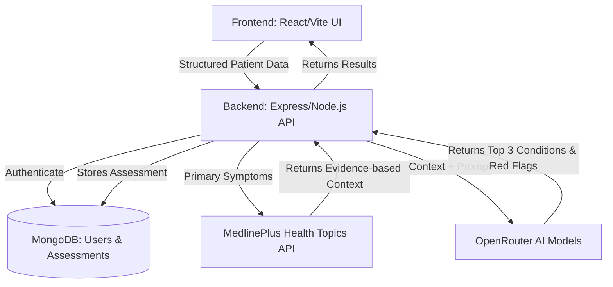

# Dooper AI Symptom Checker & Specialty Finder

An advanced AI-powered Clinical Intelligence Engine that acts as a clinical decision-support system. Instead of relying solely on LLM responses, this system collects structured patient data and combines AI reasoning with a verified medical knowledge base (MedlinePlus API) to provide highly accurate, evidence-based health assessments, confidence scores, and emergency red-flag detection.

This application replicates the modern, premium visual design language of the **Dooper** healthcare portal, using a custom Montserrat font, curated colors (Dooper Crimson Red `#E40443`), glassmorphic shadows, transitions, and support for a native Dark Mode.

---

## 🏗️ Architecture Diagram



---

## 🗄️ Database Design (MongoDB Schema)

**Assessment Schema (`server/models/Assessment.js`)**:
- `user`: ObjectId (Ref to User)
- `age`: Number
- `gender`: String
- `weight`: Number
- `height`: Number
- `existingConditions`: String
- `currentMedications`: String
- `allergies`: String
- `pregnancyStatus`: String
- `painLevel`: Number (1-10)
- `duration`: String
- `primarySymptoms`: Array of Strings (e.g. ["Fever", "Headache"])
- `secondarySymptoms`: Array of Strings
- `symptoms`: String (Additional notes)
- `aiAnalysis`: 
  - `possibleConditions`: Array of Objects (`condition`, `confidenceScore`, `supportingSymptoms`)
  - `redFlagDetected`: Boolean
  - `severityLevel`: String (Mild, Moderate, Severe)
  - `recommendedSpecialty`: String
  - `healthAdvice`: String
  - `sources`: Array of Strings
- `chatHistory`: Array of Objects (`role`, `content`, `timestamp`)

---

## 🧠 AI Workflow & Knowledge Base

### 1. Structured Data Collection
Instead of a simple text box, the frontend collects structured clinical parameters (vitals, medical history, pain scale, primary/secondary symptoms).

### 2. Knowledge Base Retrieval (MedlinePlus)
Before generating an assessment, the backend queries the **MedlinePlus Health Topics API** (National Library of Medicine) using the patient's primary symptoms to retrieve verified medical summaries.

### 3. AI Clinical Analysis
The structured patient data and the retrieved MedlinePlus context are injected into a highly engineered system prompt. The AI (via OpenRouter, falling back between multiple models) is instructed to act as a clinical decision-support engine and return:
- **Top 3 Possible Conditions** with assigned **Confidence Scores (%)**.
- **Red Flag Detection** for immediate medical emergencies.
- **Evidence-backed Sources**.

### 4. Conversation Memory
Users can ask follow-up questions within the assessment context. The AI remembers the patient's profile and the initial assessment results, maintaining continuous consultation memory.

---

## 🚀 Tech Stack & APIs Used

### Frontend (Client)
- **Framework**: React.js (built with Vite)
- **Styling**: Tailwind CSS
- **PDF Generation**: jsPDF (for generating medical report cards)

### Backend (Server)
- **Runtime**: Node.js & Express.js
- **Database**: MongoDB (via Mongoose)
- **Auth**: JSON Web Tokens (JWT)

### External APIs
- **OpenRouter API**: Access to leading open-source models (`gemma-4-31b`, `llama-3.3-70b`, etc.).
- **MedlinePlus Web Service API**: Publicly available, highly trusted health topics knowledge base used for context retrieval.

---

## 🛠️ Features

1. **Intelligent Symptom Collection**: Structured patient information including vitals and primary/secondary symptom categorisation.
2. **Top 3 Conditions & Confidence Scores**: AI ranks the most likely diagnoses.
3. **Emergency Red Flag Detection**: UI flashes a critical warning banner if severe symptoms (e.g. chest pain) are detected.
4. **Medical Source References**: Outputs the verified sources used for the assessment.
5. **Interactive AI Follow-up Chat**: Continuous contextual conversation.
6. **Assessment History**: Stores history with keyword and severity filters.
7. **Download Assessment as PDF**: Generates branded clinical reports.
8. **Dark Mode**: System-synchronized or manual light/dark toggle.

---

## ⚙️ Environment Variables

### Backend (`server/.env`)
```env
PORT=5000
MONGODB_URI=your_mongodb_atlas_connection_string
JWT_SECRET=your_jwt_signing_secret
OPENROUTER_API_KEY=your_openrouter_api_key
```

### Frontend (`client/.env`)
```env
VITE_API_URL=http://localhost:5000/api
```

---

## 📦 Local Installation & Setup

Ensure you have [Node.js](https://nodejs.org/) installed.

### 1. Clone the repository
```bash
git clone <repository-link>
cd aisymptonchecker
```

### 2. Set up Backend
```bash
cd server
npm install
npm start
```
The server will start running on [http://localhost:5000](http://localhost:5000).

### 3. Set up Frontend
Open a new terminal window:
```bash
cd client
npm install
npm run dev
```
The frontend application will be running on [http://localhost:5173](http://localhost:5173).

---

## ☁️ Deployment Instructions

### Deploying the Backend (Node.js/Express) to Render
1. Sign up on [Render](https://render.com/).
2. Click **New** -> **Web Service**.
3. Connect your GitHub repository.
4. Set the following settings:
   - **Root Directory**: `server`
   - **Build Command**: `npm install`
   - **Start Command**: `node server.js`
5. Go to the **Environment** tab and add the environment variables (`MONGODB_URI`, `JWT_SECRET`, `OPENROUTER_API_KEY`).
6. Click **Deploy**. Copy the generated URL.

### Deploying the Frontend (Vite/React) to Vercel
1. Sign up on [Vercel](https://vercel.com/).
2. Click **Add New** -> **Project**.
3. Import your GitHub repository.
4. Set the following settings:
   - **Root Directory**: `client`
   - **Build Command**: `npm run build`
   - **Output Directory**: `dist`
5. Expand the **Environment Variables** section and add:
   - `VITE_API_URL` = `your_render_backend_url/api`
6. Click **Deploy**.
