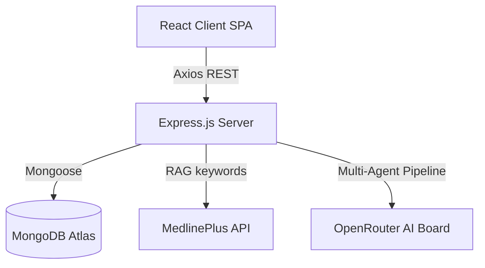

# Dooper — AI Virtual Healthcare Agent (Phase 4)

Dooper is a comprehensive Virtual Healthcare Agent and Health Coordinator ecosystem. It moves beyond a standalone symptom chatbot, functioning as an intelligent health assistant that maintains a persistent digital profile, references long-term memory, analyzes uploaded medical records, audits medication safety, and suggests check-ups and reminders.

> ⚠️ **Medical Disclaimer:** Dooper is an AI-powered triage and health coordinator assistant designed for decision support. It is **NOT** a substitute for professional medical diagnosis, treatment, or advice. Always consult a licensed healthcare provider for medical evaluations.

---

## 1. System Architecture

Dooper is structured as a full-stack Javascript web application:

- **Frontend:** Single-page React 18 application built with Vite, styled with Vanilla CSS matching the Dooper Montserrat brand aesthetics (Crimson Red `#E40443`, glassmorphism, responsive cards).
- **Backend:** Node.js + Express.js API server handling authentication, multi-agent AI pipeline orchestration, document processing, and data tracking.
- **Database:** MongoDB + Mongoose schemas storing patient profiles, consultation histories, care reminders, and parsed biomarker logs.
- **AI Triage Board:** OpenRouter API orchestration running specialized agent prompts (Symptom Analysis, Medical Knowledge, report parsing, Medication Safety, Care Plans, and Emergency checks).
- **Medical References:** MedlinePlus Connect (U.S. National Library of Medicine) XML search API queried in parallel during consults.


```mermaid
graph TD
    Client[React Client SPA] -->|Axios REST| Express[Express.js Server]
    Express -->|Mongoose| MongoDB[(MongoDB Atlas)]
    Express -->|RAG keywords| Medline[MedlinePlus API]
    Express -->|Multi-Agent Pipeline| OpenRouter[OpenRouter AI Board]
```

---

## 2. Multi-Agent Workflow

When a consultation is completed, the **Lead Coordinator Agent** orchestrates 6 virtual specialized agents to compile the health report:

```mermaid
graph TD
    UserMsg[Symptom Form / Chat Turn] --> Coordinator[Lead Coordinator Agent]
    Coordinator --> Memory[Long-Term History Loader]
    Coordinator --> RAG[RAG Medical Searcher]
    
    subgraph AI Board ["Virtual Multi-Agent Clinical Board"]
        Agent1[Symptom Analysis Agent]
        Agent2[Medical Knowledge Agent]
        Agent3[Medical Report Agent]
        Agent4[Medication Safety Agent]
        Agent5[Care Plan Agent]
        Agent6[Emergency Detection Agent]
    end

    Coordinator --> AI Board
    AI Board --> FinalJSON[Synthesized Clinical JSON]
    FinalJSON --> DB[Save to Database]
    DB --> ClientView[Dashboard / Timeline / PDF Export]
```

---

## 3. Database Schema

### User Schema (`User.js`)
Stores account credentials and the persistent health profile:
- `fullName`: String (Required)
- `email`: String (Required, Unique)
- `password`: String (Hashed with bcrypt)
- `profile`:
  - `age`: Number
  - `gender`: String
  - `height`: Number (cm)
  - `weight`: Number (kg)
  - `bloodGroup`: String
  - `allergies`: String
  - `chronicDiseases`: String
  - `currentMedications`: String
  - `previousSurgeries`: String
  - `familyHistory`: String
  - `lifestyleInfo`: String
  - `smokingStatus`: String ('smoker', 'non-smoker', '')
  - `alcoholStatus`: String ('non-drinker', 'occasional', 'regular', '')

### Assessment Schema (`Assessment.js`)
Tracks the consultation Q&A and differential report:
- `user`: ObjectId (Ref User)
- `status`: String ('consulting', 'completed')
- `primarySymptoms` / `secondarySymptoms` / `symptoms`: Arrays & Strings
- `uploadedReportName` / `uploadedReportText`: Strings
- `chatHistory`: Array of `{ role, content, timestamp }`
- `aiAnalysis`:
  - `possibleConditions`: Array of `{ condition, confidenceScore, matchingSymptoms, missingSymptoms, reasoning }`
  - `redFlagDetected`: Boolean
  - `severityLevel`: String ('Mild', 'Moderate', 'Severe')
  - `recommendedSpecialty` / `recommendedSpecialtyExplanation`: Strings
  - `healthAdvice`: String
  - `sources`: Array of Strings
  - `carePlan`: `{ dietSuggestions, exerciseRecommendations, hydrationGoals, sleepAdvice, lifestyleImprovements, followUpTimeline }`
  - `medicationSafety`: `{ duplicateMedications, allergyConflicts, drugInteractions, highRiskCombinations, alerts }`
  - `serviceRecommendations`: Array of `{ serviceName, description, reason, actionText }`
  - `agentContributions`: Array of `{ agentName, contribution }`
  - `labTrends`: Array of `{ biomarker, value, unit, trend }`

### Care Reminder Schema (`Reminder.js`)
Schedules checkups, test dates, and medication habits:
- `user`: ObjectId (Ref User)
- `title`: String
- `type`: String ('medication', 'consultation', 'lab', 'checkup')
- `dueDate`: Date
- `status`: String ('pending', 'completed')
- `associatedAssessment`: ObjectId (Ref Assessment)

### Lab Result Schema (`LabResult.js`)
Stores structured lab measurements extracted from reports for charts:
- `user`: ObjectId (Ref User)
- `biomarker`: String ('blood_sugar', 'hemoglobin', 'vitamin_d', 'cholesterol')
- `value`: Number
- `unit`: String
- `date`: Date
- `sourceAssessment`: ObjectId (Ref Assessment)

---

## 4. Prompt Engineering Strategy

Our prompt strategy uses a **Coordinated Board Prompting** model rather than slow individual chain-of-thought calls. This keeps response latency under 5 seconds:

- **System Context Injections:** On every consultation advancement, the system automatically fetches the user's persistent profile and previous completed diagnoses.
- **System Role Definitions:** The LLM is commanded to role-play as a lead clinical coordinator board. It must validate inputs against 6 distinct perspective directives (e.g. cross-referencing allergies under the Medication Safety directive).
- **JSON Structure Constraints:** The prompt forces the LLM to write its output in a strict JSON format (disabling markdown wrappers). This allows the backend to parse results, extract biomarkers, and populate database values dynamically.

---

## 5. APIs & Medical Knowledge Sources

- **OpenRouter API:** Serves as the AI reasoning interface, fallback-cycling through models (Gemma-4-31B, Llama-3.3-70B, GPT-OSS) for high reliability.
- **MedlinePlus Search API:** Evaluates extracted user symptoms against the National Library of Medicine database, fetching health topic abstracts.
- **OpenFDA connection guidelines:** Evaluates medication safety warnings and drug interactions.

---

## 6. Setup on Your Computer

### Prerequisites
Make sure you have [Node.js](https://nodejs.org/) (v18+) and [MongoDB](https://www.mongodb.com/) installed.

### 1. Start the Backend Server
```bash
cd server
npm install
npm start
```
The server runs at `http://localhost:5000`.

### 2. Start the Frontend App
Open a new terminal window:
```bash
cd client
npm install
npm run dev
```
Open your browser to `http://localhost:5173`.

### 3. Environment Setup

**Backend (`server/.env`):**
```env
PORT=5000
MONGODB_URI=your_mongodb_connection_string
JWT_SECRET=your_jwt_secret_key
OPENROUTER_API_KEY=your_openrouter_api_key
```

**Frontend (`client/.env`):**
```env
VITE_API_URL=http://localhost:5000/api
```
